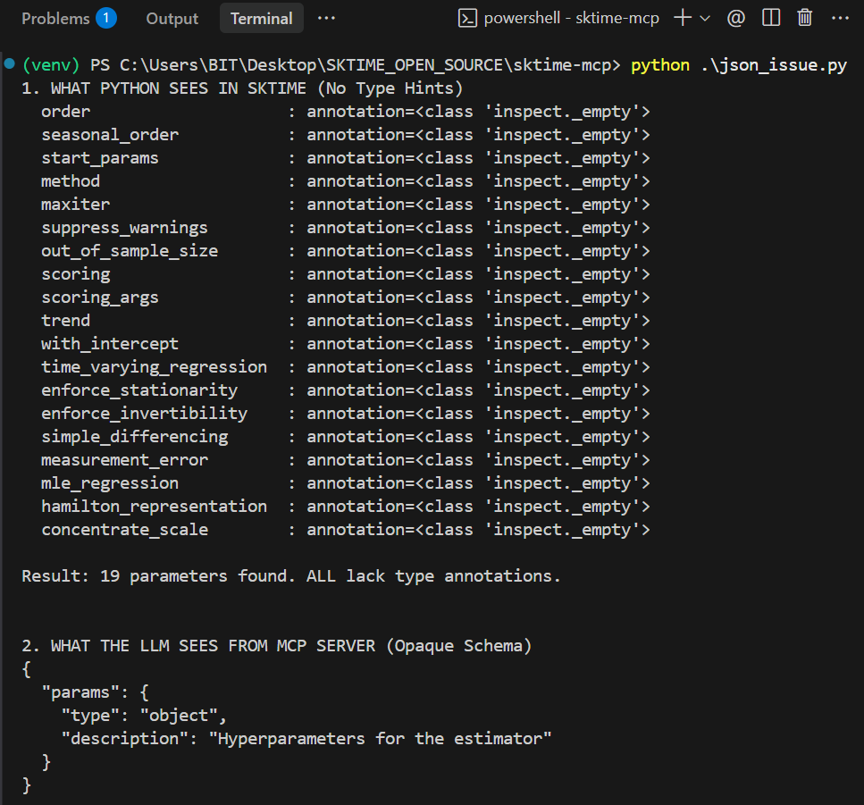
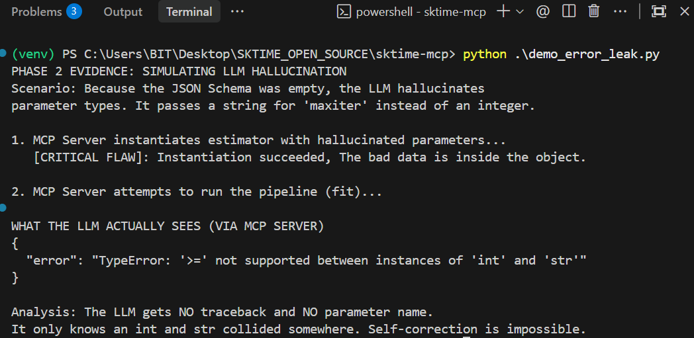
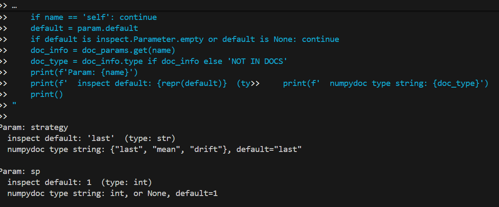
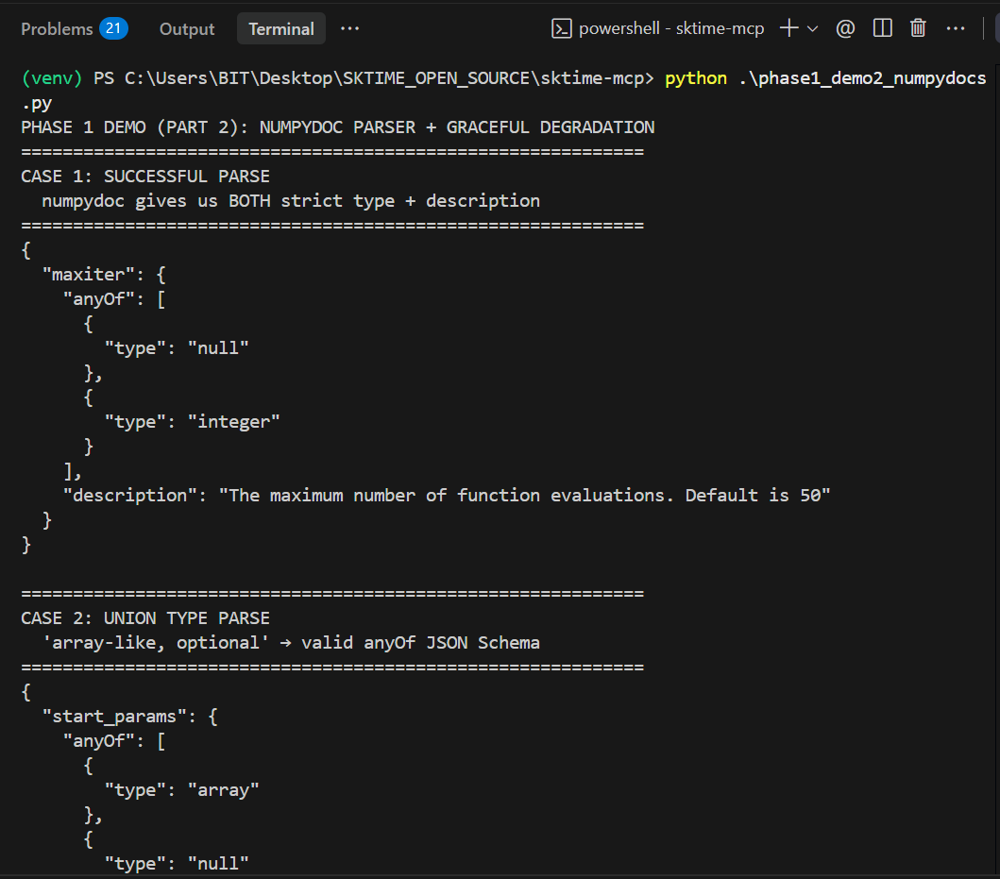
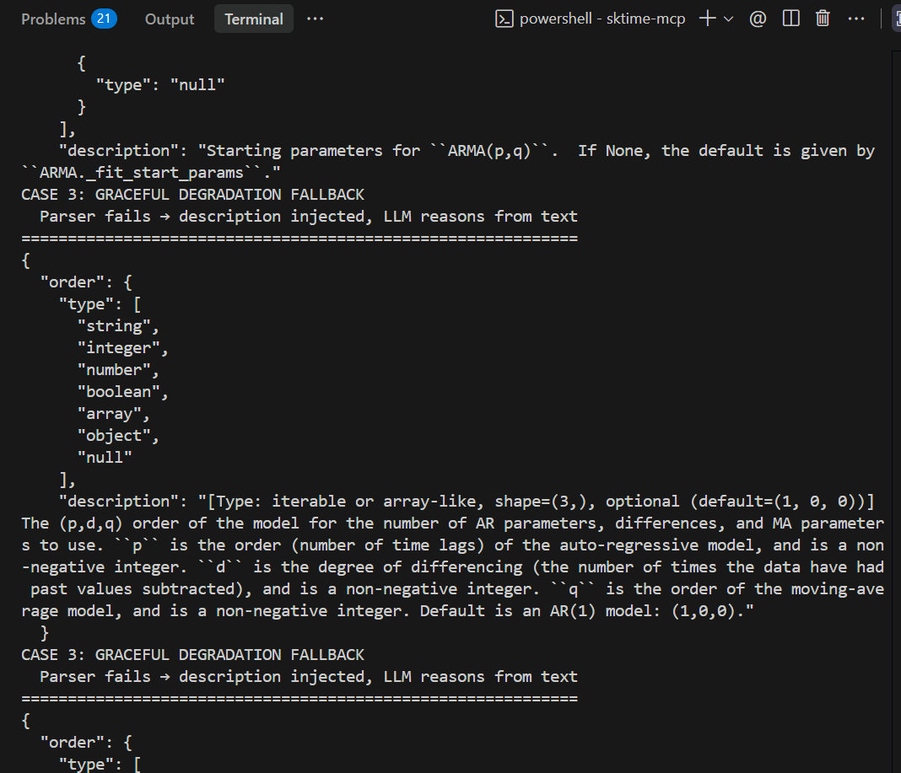
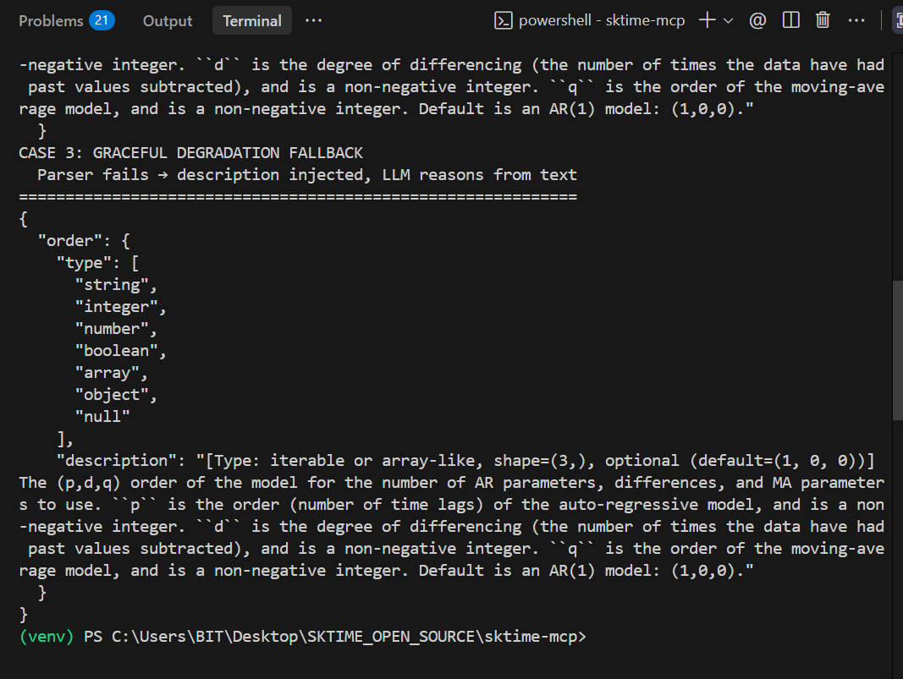
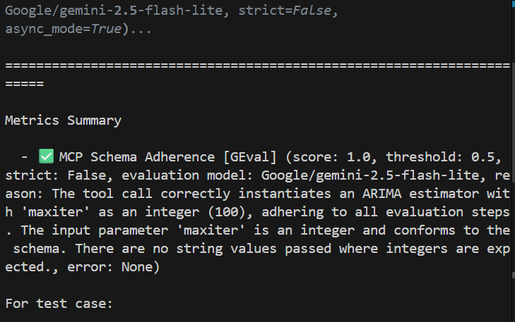
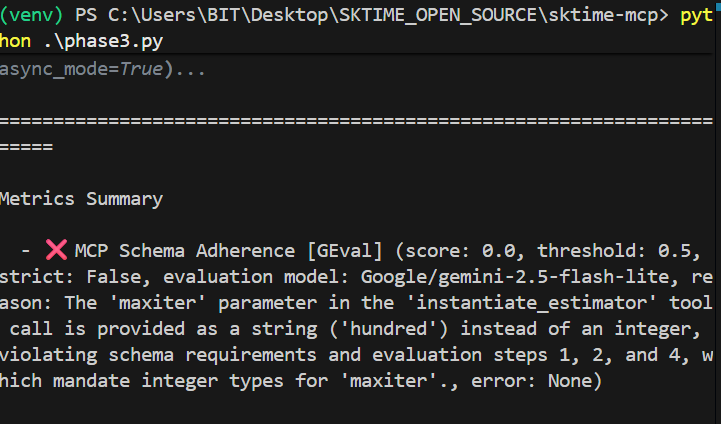

# Robust Agentic Tooling for sktime-mcp: Dynamic Schema Introspection and Automated Compatibility Testing

---

## Introduction

The Model Context Protocol (MCP) server for sktime is currently **prone to fatal crashes during complex agentic** workflows because the **lack of estimator type hints prevents the generation of strict JSON tool schemas**. Without these constraints, large language models (LLMs) are **forced to blindly guess parameter types, inevitably hallucinating** inputs that trigger unhandled Python exceptions and destroy the autonomous loop. To make the server entirely resilient to LLM's indeterministic output, I propose building a **three-tiered reliability pipeline: dynamic JSON schema generation via runtime introspection, a defensive validation middleware to translate crashes into LLM-recoverable feedback, and an automated evaluation suite to benchmark tool compatibility.**

---

## The Problem & Evidence

When auditing the current architecture and reviewing community issues, three critical failure points emerge that prevent true autonomous reliability:

### 1. Schema Blindness (Why is the LLM hallucinating?)

For an LLM to reliably use a tool, it requires a strict JSON Schema (a "rulebook") detailing exactly what data types are allowed. However, the underlying sktime estimators currently lack `__init__` type hints. Without these hints, the MCP server cannot generate a strict schema.


*Fig1. The image clearly shows us the missing type hints in the forecaster **ARIMA**, the schema which LLM gets does not **contain** any information due to which it ends up guessing the types hence more prone to hallucinations*

---

### 2. Fatal Exception Leaks (Why can't the LLM fix its own mistakes?)

When an LLM inevitably hallucinates a bad parameter, the server lacks a defensive barrier. Instead of gracefully rejecting the input, the underlying sktime engine throws a raw Python `TypeError` or `ValueError` (as tracked in issues #172 and #192). This exception completely crashes into the agent loop. The LLM receives a messy stack trace instead of an "LLM-recoverable error" — a structured JSON response (e.g., `{"error": "horizon must be an integer"}`) that would allow the agent to understand its mistake and try again on the next turn.

*Fig2. in this **particular code** I passed a string to **maxiter** parameter in ARIMA instead of **the integer**.*

*1) The "hallucinated data" is sent inside the object without any issue, no guardrails present here*

*2) The error message which LLM receive **contains** no value at all, hence the LLM does not even know where exactly it went **wrong**.*

---

### 3. Verification Bottleneck (How do we know it works?)

As hallucinations take various forms — wrong data types, out-of-bounds ranges, or incorrect tool selection — maintainers cannot rely on manual, human testing for every prompt variation. The project currently lacks a programmatic way to measure whether the MCP server is actually guiding the LLM correctly.

---

## Proposed Solution

We cannot control an LLM's non-determinism, but we can build an infrastructure that absorbs it. To ensure agents can self-correct and execute long-running pipelines without human intervention, I am proposing a reliability pipeline: Dynamic Schema Generation (giving the LLM the rulebook), Defensive Validation Middleware (enforcing the rules and enabling self-correction), and Automated Testing (proving the rules work) via DeepEval framework.

---

## Phase 1: Dynamic Schema Introspection & NLP Parsing

### Why Not Just Pass the Description?

While passing the English description gives the LLM context, it does not provide *enforcement*. If we only pass descriptions, the LLM can arbitrarily decide to pass `"100"` instead of `100`. By generating a strict JSON Schema, we utilize the MCP protocol to mathematically block the LLM from passing invalid data types.

### Code vs. Documentation

The core engineering challenge of Phase 1 is resolving the conflict between what Python code says and what the documentation says.

Initially, one might assume we can just use Python's `inspect.signature` to infer types based on default values. However, during prototyping, I discovered this creates a severe limitation.


*Fig 3: The limitations of relying on inspection. As shown in this prototype, **the inspect** shows the default for **sp** is **1** (an integer). If we build the schema solely from **inspect**, the LLM is strictly locked to integers. However, **numpydoc** reveals the true capability: **int or None**. If we rely on code defaults, we actively block the LLM from **utilizing** valid features like **sp=None**.*

### The Intelligent Schema Compiler

To solve this, Phase 1 will implement a robust NLP parser utilizing `numpydoc.docscrape`. The final architecture will operate as a priority chain:

- **Type Constraints (The Cage):** We will use NLP regex parsing on the numpydoc type string to generate strict JSON Schema `anyOf` arrays (e.g., converting `"int or array-like"` to `{"anyOf": [{"type": "integer"}, {"type": "array"}]}`).

- **Graceful Degradation:** If the parsed type is a complex Python object that JSON cannot represent (e.g., a custom class), the parser will degrade gracefully, injecting the constraint into the parameter's description and allowing the LLM to use its reasoning to format the object.

- **Required Status:** Inspect will be used exclusively as the final safety net to determine if a parameter has no default value and must be injected into the schema's `"required"` list.

**VIDEO LINK (The video explains the initial prototype of Phase 1 and why it's required) —** [https://youtu.be/BV8Cxm6Gn_E](https://youtu.be/BV8Cxm6Gn_E)



*Fig 4-6: The Intelligent Schema Compiler in action. The prototype successfully parses standard types (Case 1) and complex union types like "array-like" (Case 2) into mathematically strict JSON Schema constraints. For highly complex Python types that cannot map to JSON (Case 3), the parser triggers a Graceful Degradation fallback — opening the JSON constraints to prevent false API rejections, while injecting the raw type requirements directly into the text description so the LLM can self-correct using its native reasoning.*

---

## Phase 2: Defensive Validation Middleware

Generating the schema solves half the problem; we must also enforce it. Currently, estimators silently accept hallucinated data and crash later in the pipeline.

- I will implement a validation middleware layer that intercepts all LLM payloads *before* they reach the underlying sktime engine.

- The middleware will validate the incoming payload against the Phase 1 dynamic schema. If the LLM violates a type constraint (e.g., passing a string instead of an integer for `maxiter`), the middleware will immediately reject it and return a structured JSON payload: `"success": false, "error": "Parameter 'maxiter' must be integer. Got string 'hundred'."`. I have already implemented something similar in my #PR 193 wherein I enforced informative error messages being sent to the LLM instead of raw python leaks for the `horizon` parameter.

- This entirely prevents traceback leaks and gives the LLM the exact context it needs to be self-corrected in the next turn.

---

## Phase 3: Automated "Agentic" Compatibility Testing

To break free from our reliance on end-users reporting bugs in production, we need a programmatic way to measure whether our schemas and middleware keep the LLM on track.

Phase 3 is the essential validation of the entire project. While Phases 1 and 2 provide the Rulebook (Schemas) and the Bouncer (Middleware), Phase 3 provides the Audit — programmatically proving that these interventions actually improve the agent's performance. By automating the QA process, we shift the project from a reactive "wait for users to report bugs" model to a proactive "benchmark before releasing" infrastructure.

**The Continuation Logic:**

- **Validating the Phase 1 Rulebook:** Using DeepEval's GEval metric, the framework uses the dynamic schemas generated in Phase 1 as the source of truth to score the LLM. It answers: *"Did my generated schema provide enough clarity for the LLM to choose the right parameters?"*

- **Testing the Phase 2 Recovery:** The suite specifically benchmarks the Self-Correction Rate. When the Middleware (Phase 2) sends back an error message, Phase 3 measures if the LLM successfully uses that specific feedback to rectify its tool call in a single turn.

- **Automating the Human Loop:** Currently, sktime-mcp reliability is measured by user complaints. I will replace this with a synthetic evaluation dataset of 30+ core workflows. This allows maintainers to verify that a new update hasn't "blinded" the agent, ensuring that the improvements from Phases 1 and 2 remain robust across different model versions (Claude, Gemini, Llama).
- **Strategic Isolation:** Explicitly decouple the Agentic Benchmarking suite from the core pytest suite. This tool will be architected as a manual diagnostic utility (eg  make benchmark or python -m eval), ensuring no token costs or non-deterministic failures are introduced into the standard PR CI/CD pipeline.

To ensure this remains a permanent, zero-cost asset for the community; the suite features a 'Bring Your Own Key' architecture. Maintainers can choose between high-fidelity frontier judges (e.g., GPT-4o) or route the judge to a local server (e.g., Ollama) for free, private testing in GitHub Actions.




*Fig. 7-8. These screenshots demonstrate the final automated testing pipeline evaluating simulated LLM ToolCall traces against the dynamic schemas generated in Phase 1. Using a 'Bring Your Own Key' architecture, a custom **Gemini-2.5-Flash-Lite** judge mathematically scores schema adherence. The top image shows a passing test (Score: 1.0) where the LLM successfully adhered to the integer constraint (**maxiter=100**). The bottom image demonstrates the framework successfully catching a simulated hallucination (Score: 0.0), correctly identifying that the string **'hundred'** violates the schema constraint. This pipeline replaces manual QA, allowing maintainers to mathematically verify that any future changes to prompts or schemas do not degrade the LLM's performance.*

---

## Timeline
## Phase 1: Dynamic JSON Schema Generation (Weeks 1–5)

### Week 1: Signature-Level Introspection & Default-Value Type Inference

**Objective:** Week 1 establishes the baseline schema generator using `inspect.signature()`. This produces correct schemas for ~40% of parameters (primitives with non-None defaults). The known limitations documented here directly motivate the NLP parser built in Week 3.

**Tasks:**

- Use `inspect.signature(EstimatorClass.__init__)` to programmatically extract all constructor parameters and their default values for any sktime estimator.

- Implement a type-inference engine that maps Python default values to JSON Schema types.

- Generate a complete JSON Schema object per estimator.

- Validate the generated schemas against known estimators (e.g., ARIMA, ExponentialSmoothing, NaiveForecaster) to confirm accuracy.

**Known Limitation (to be addressed in Weeks 3–4):** Parameters with `default=None` (e.g., `ARIMA(start_params=None)`, `ARIMA(trend=None)`, `AutoARIMA(d=None)`) will be incorrectly typed as `"string"` because `type(None)` carries no semantic information about the parameter's actual expected type. This affects approximately 40–60% of parameters across sktime estimators. Furthermore, a parameter's default value does not comprehensively represent its allowed data types, necessitating the NLP parser introduced in Week 3.

---

### Week 2: Schema Router Integration into server.py

**Objective:** Integrate the schema generator into the live MCP server so that every tool definition dynamically includes its JSON Schema in the `inputSchema` field.

**Tasks:**

- Identify the tool registration entry points in `server.py` where MCP tools (e.g., `instantiate_estimator`, `fit_predict`) are defined and exposed to the LLM.

- Modify the tool registration logic to call `schema_generator.generate_schema(EstimatorClass)` at server startup and attach the resulting JSON Schema to each tool's `inputSchema` property.

- Ensure the schema is served dynamically: if a new estimator is added to sktime, the server automatically generates and serves its schema without any manual hardcoding.

- Test the integration end-to-end by connecting an MCP client (e.g., Claude Desktop) and verifying that the LLM now receives typed parameter hints in its tool definitions.

- **Permissive Generation (Inform, Don't Enforce):** During Phase 1, the generated schemas are strictly used to *inform* the LLM — updating the `inputSchema` field in `server.py` so the LLM receives detailed parameter rules instead of a blank `{"type": "object"}`. At this stage, the server will not actively block requests if the LLM violates the schema; it relies on sktime's existing internal errors (the current behavior). This allows us to safely validate the accuracy of the generated schemas in production before turning on strict server-side enforcement in Phase 2 (Week 6). If the NLP parser cannot confidently map a docstring type to a JSON primitive, it will leave the parameter's JSON constraint open and inject the raw type requirements into the text `description`, preventing False Positive rejections where valid inputs might be accidentally blocked.

---

### Week 3: NLP Docstring Parsing with numpydoc

**Objective:** Solve the None-default problem, the Union Type problem and the unmentioned data types in default issue by parsing human-readable type information from sktime's numpydoc-formatted docstrings. Also the docstring description gives us the complete description regarding the parameter helping the LLM even more better guesses.

**Tasks:**

- Integrate the `numpydoc` library to programmatically parse the `Parameters` section of any sktime estimator's docstring into structured `(name, type_string, description)` tuples.

- Build a regex/NLP parser that converts numpydoc type strings into JSON Schema types. Examples of real sktime type strings that must be handled:

  - `"int, optional (default=50)"` → `{"type": "integer"}`

  - `"float or None, optional (default=None)"` → `{"anyOf": [{"type": "number"}, {"type": "null"}]}`

  - `"str, one of {'aic', 'bic', 'hqic', 'oob'}"` → `{"type": "string", "enum": ["aic", "bic", "hqic", "oob"]}`

**Known Limitation (to be addressed in Week 4):** There can be unusual docstring formats and the issue of JSON primitive data type limitations; sktime uses custom objects as data types for which there is no corresponding JSON data type.

---

### Week 4: Schema Validation & Edge Cases

**Objective:** Harden the schema generator against edge cases discovered during testing.

**Tasks:**

- Fix edge cases discovered during testing: unusual docstring formats, parameters with complex default objects, estimators with dynamically generated signatures.

- Write unit tests (`test_schema_generator.py`) covering:

  - Correct type inference for all primitive types (`int`, `float`, `str`, `bool`, `None`).

  - Correct `anyOf` generation for union types (e.g., `float or None`).

  - Correct `enum` generation for constrained string parameters.

  - Graceful fallback behavior when docstrings are missing or complex data types like `callable`, `iterable` are used.

  - The fallback would include giving the description of the parameter using numpydoc which would help the LLM to make an intelligent guess rather than flying blind.

---

### Week 5: Bulk Testing Across Estimator Registry & Phase 1 PR

**Objective:** Run the schema generator against the full breadth of sktime's estimator ecosystem and submit the Phase 1 Pull Request.

**Tasks:**

- Run the schema generator against the full set of forecasters currently supported by sktime-mcp's execution tools. The target is ≥85% strict schema coverage across this set; parameters that fail parsing will fall back to description-only hints rather than blocking tool registration. Expansion to other estimator types will be scoped based on maintainer direction during the review phase.

- Catalog the success rate: track what percentage of parameters are strictly typed vs. gracefully degraded, providing a quantitative metric for the pipeline's coverage.

- Fix any new edge cases or docstring formats discovered during bulk testing.

- Submit Phase 1 Pull Request for maintainer review.

---

## Phase 2: Validation Middleware & Deterministic Testing (Weeks 6–8)

### Week 6: Middleware Implementation & Execution Boundary Hardening

**Objective:** Implement the `jsonschema`-based validation gate and wrap all sktime execution paths with a generic safety boundary to prevent server crashes.

**Tasks:**

- Implement a `validate_tool_params(tool_name, params, schema)` function that runs `jsonschema.validate(params, schema)` and catches `ValidationError` exceptions.

- Transform caught `ValidationError` exceptions into structured, LLM-friendly JSON error responses:

```json
{
  "success": false,
  "error_type": "SCHEMA_VALIDATION_ERROR",
  "error": "Parameter 'maxiter' must be of type integer, but received string 'hundred'.",
  "hint": "Please provide an integer value for 'maxiter' (e.g., 50, 100, 200)."
}
```

- Inject the validation function into `server.py`'s request handling pipeline, ensuring it executes **before** any estimator instantiation or method call.

- **Enforcement Intensity controlled via Feature Flag:** To safely introduce strict validation without risking False Positive rejections from imperfect schemas, `validate_tool_params()` will be controlled by an environment variable (`ENFORCE_STRICT_SCHEMA`). In **Audit Mode** (default initially), validation runs but failures only log a warning and let the payload pass through to sktime. In **Strict Mode**, validation actively intercepts malformed payloads and returns the structured `SCHEMA_VALIDATION_ERROR` to the LLM for self-correction. The switch to Strict Mode by default will be made once Phase 3 benchmarks prove the schemas are highly accurate.

- Wrap all sktime execution boundaries in `executor.py` (`fit`, `predict`) with a generic `try/except Exception` block to safely intercept any runtime errors that pass through schema validation. Implement a `warnings.catch_warnings()` context manager to capture soft warnings (e.g., `ConvergenceWarning`) and forward them to the LLM as self-correction hints.

- Verify that valid payloads pass through the middleware untouched and reach the executor normally.

---

### Week 7: Error Taxonomy, Response Standardization & pytest Suite

**Objective:** Standardize all error responses across the server into a consistent format, and write comprehensive deterministic tests.

**Tasks:**

- Implement a centralized `format_error_response(error_type, message, hint)` utility that all error paths use, ensuring a consistent JSON structure:

```json
{
  "success": false,
  "error_type": "EXECUTION_ERROR",
  "error": "ARIMA model failed to converge after 50 iterations.",
  "hint": "Try increasing 'maxiter' or simplifying the model order."
}
```

- Define a formal error taxonomy with two distinct error codes:

  - `SCHEMA_VALIDATION_ERROR` — **New.** Type mismatch caught by the jsonschema middleware before reaching sktime. This is the primary contribution of Phase 2.

  - `EXECUTION_ERROR` — The EXECUTION_ERROR wrapper will specifically target sktime and scikit-learn domain exceptions while allowing critical system exceptions (e.g., MemoryError, KeyboardInterrupt) to propagate, ensuring server observability is maintained.

- Write parameterized pytest test cases covering:

  - **Type validation:** Passing strings, floats, lists, and `None` to parameters that expect integers. Verify the middleware returns `SCHEMA_VALIDATION_ERROR` with an actionable hint.

  - **Execution error wrapping:** Simulating sktime runtime failures and verifying they are caught and returned as structured `EXECUTION_ERROR` payloads instead of raw tracebacks.

  - **Pass-through:** Passing fully valid payloads. Verify the middleware does not interfere and the estimator executes successfully.

  - **Response consistency:** Verify that all error responses follow the standardized JSON structure.

---

### Week 8: Integration Testing, Documentation & Phase 2 PR

**Objective:** Perform end-to-end integration testing, document the middleware, and submit the Phase 2 Pull Request.

**Tasks:**

- Run end-to-end integration tests: connect an MCP client, send intentionally malformed payloads, and verify the full pipeline (schema validation → execution boundary → error formatting) works as a cohesive unit.

- Ensure all tests are deterministic (no LLM calls, no network dependencies) and can run in CI/CD via `pytest` alone.

- Document the middleware's public API: how to add new error types, how the validation pipeline integrates with `server.py`, and how the error taxonomy maps to LLM self-correction.

- Submit Phase 2 Pull Request for maintainer review.

---

## Phase 3: Agentic Benchmarking & Documentation (Weeks 9–10)

### Week 9: DeepEval Agentic Benchmarking Suite

**Objective:** Build an automated evaluation framework that programmatically scores LLM adherence to the Phase 1 schemas using DeepEval's GEval metric and a pluggable judge architecture.

**Tasks:**

- Implement a `DeepEvalBaseLLM` subclass that routes evaluation calls to any LLM provider via a "Bring Your Own Key" architecture. This allows maintainers to:

  - Plug in frontier models (e.g., Gemini, GPT-4o, Claude) for high-fidelity evaluation.

  - Route to a local Ollama server (e.g., Phi-3, Llama 3) for zero-cost, offline testing in GitHub Actions.

- Define a custom GEval metric (`MCP Schema Adherence`) that evaluates whether the ToolCall traces generated by the LLM conform to the JSON Schema constraints (correct types, valid enum values, no hallucinated parameters).
---

### Week 10: Creating Evaluation Dataset and Final Documentation

**Objective:** Document the entire reliability pipeline, integrate it into the project's CI/CD workflow, and submit the final Pull Request.

**Tasks:**

- Build an `EvaluationDataset` containing 20–30 parameterized test prompts representing common and complex sktime-mcp user interactions:

  - `"Forecast the next 12 months using ARIMA with max iterations set to 200"`

  - `"Fit an ExponentialSmoothing model on data_handle xyz"`

  - `"Run NaiveForecaster with strategy set to 'last'"`

- Wire the evaluation pipeline: for each prompt in the dataset, capture the LLM's ToolCall trace, inject it into an `LLMTestCase`, and run the GEval judge to produce a schema adherence score.

- Write comprehensive documentation covering the three parts — Schema Generation, Middleware, DeepEval suite.

- Final code cleanup, docstring review, and submission of the Phase 3 Pull Request.

- Write a project summary report documenting the overall architecture, design.

---

## WHY ME

I am applying to implement the **sktime-mcp Reliability Pipeline** because it sits perfectly at the intersection of my experience building autonomous agentic systems and my deep familiarity with sktime's internal architecture. I have already begun tackling the exact problems outlined in this proposal, and my background ensures I can execute all three phases effectively.

---

### 1. Proven Foundation in sktime-mcp and Error Boundary Hardening *(Directly maps to Phase 2)*

I am already actively contributing to the sktime-mcp repository and have prototyped the core concept of the Validation Middleware. In [**Issue #192**](https://github.com/sktime/sktime-mcp/issues/192) and [**PR #193**](https://github.com/sktime/sktime-mcp/pull/193), I identified a critical flaw where the predicted tool raised unhandled internal TypeErrors when an LLM hallucinated a string instead of an integer for the `horizon` parameter. Because the tool lacked a type of boundary, raw Python tracebacks were leaking to the LLM over the MCP protocol, destroying its ability to self-correct. I successfully implemented a functional type of boundary that intercepts these invalid types and returns a structured JSON error, laying out the groundwork for the comprehensive middleware proposed in Phase 2.

---

### 2. Deep Knowledge of sktime Core Internals *(Directly maps to Phase 1)*

Building the Phase 1 Dynamic Schema Generator requires an intimate understanding of how sktime estimators are structured, tagged, and documented. I have extensive experience working inside sktime's core:

- [**PR #9852**](https://github.com/sktime/sktime/pull/9852) **([ENH] Multivariate broadcasting for detectors):** I implemented automatic broadcasting for the `BaseDetector` class enabling any univariate detection algorithm to handle multivariate and hierarchical datasets without any changes to the algorithm itself, giving me deep exposure to sktime's base classes, data structures (`VectorizedDF`), and parameter routing.

- [**PR #9732**](https://github.com/sktime/sktime/pull/9732) **([ENH] Vectorizer fast track):** I bypassed heavy input checks for vectorized data, optimizing core performance bottlenecks.

- [**PR #9552**](https://github.com/sktime/sktime/pull/9552) **(capability:update tests):** I implemented and tested tagging capabilities across the Detrender, Deseasonalizer, and Lag transformers.

I know how sktime's constructor signatures, numpydoc conventions, and tagging systems work, which is critical for programmatically introspecting parameters in Phase 1 without breaking the server.

---

### 3. Production-Level Agentic AI Engineering *(Directly maps to Phase 3)*

Understanding how LLMs consume tools and fail is required to build the Phase 3 Agentic Benchmarking suite. My most relevant independent project is **SATYA** *(github: https://github.com/AnimeshPatra2005/truth_engine_v1)*, an autonomous investigative platform built around a multi-agent LangGraph state machine. In SATYA, I solved the exact LLM unreliability issues sktime-mcp currently faces:

- **LLM Inconsistency:** Standard LLMs were too agreeable and produced highly variable results across runs. I engineered an adversarial "Courtroom" architecture (Prosecutor vs. Defender agents) and a Consensus Engine with zero-temperature routing to ensure deterministic, robust outputs.

- **Strict JSON Enforcement:** I used prompt engineering as "logic engineering," imposing strict schemas and adversarial constraints to reliably extract structured JSON from reasoning models without hallucinations.

- **Resource Orchestration:** I hit Gemini's API rate limits quickly and solved it by building a "Thinking Budget" allocator that dynamically routed tasks between low-tier and high-tier models, reducing costs by 75% without sacrificing output quality.

---

**Commitment:** With no other commitments during the 10-week ESoC period, I will dedicate 18–20 hours per week to this project, ensuring the pipeline is hardened, fully tested, and documented.
